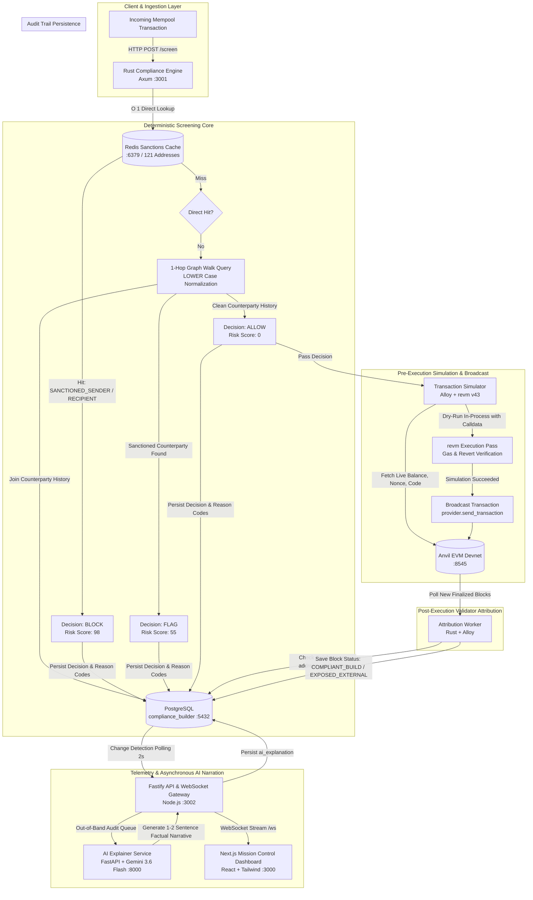

# Compliance-Aware Block Builder

> **Smart India Hackathon 2026**  
> *Pre-Execution Mempool Screening, 1-Hop Audit Graph Walks, In-Process `revm` Dry-Runs, & Post-Execution Validator Attribution*

Ethereum block builders operate under stringent legal and regulatory environments where compliance failure introduces existential liabilities. Today, builders face two distinct challenges: **inclusion risk** (unknowingly packaging OFAC-sanctioned transactions into proposed blocks, creating direct exposure to SDN regulations) and **attribution blindness** (building atop or interacting with blocks proposed by sanctioned validators or mining pools without post-execution visibility).

The **Compliance-Aware Block Builder** eliminates both risks:
- **Pre-Execution Deterministic Screening**: Every transaction submitted to the builder is screened sub-millisecond before execution. Direct sanctions checks run in $O(1)$ memory time via a Redis set populated from authoritative OFAC lists. Clean direct addresses are evaluated through a 1-hop SQL graph walk across the builder's own immutable `compliance_decisions` table to detect indirect counterparty exposure. Approved transactions undergo an in-process `revm` simulation against Anvil's live state to guarantee execution parity before broadcast.
- **Post-Execution Proposer Attribution**: A dedicated background worker monitors finalized blocks on-chain, inspecting block beneficiary (coinbase) addresses against attribution tables to detect blocks mined or proposed by sanctioned entities (`EXPOSED_EXTERNAL` vs. `COMPLIANT_BUILD`).
- **Strict Architectural Separation**: Compliance policies (`ALLOW`, `FLAG`, `BLOCK`) and risk scores are **100% computed by compiled Rust code**. An asynchronous Python microservice (Gemini 3.6 Flash) operates strictly out-of-band to narrate audit reports—**the AI explains decisions; it never makes them.**

---

## Architecture Overview



---

## Tech Stack

| Component | Directory | Language / Framework | Primary Responsibility |
|---|---|---|---|
| **Compliance Engine** | [`engine/`](engine/) | Rust 1.80+ (Axum, SQLx, Redis, Tokio) | Deterministic sub-millisecond screening engine ($O(1)$ direct sanctions check + 1-hop graph walk). |
| **Transaction Simulator** | [`simulator/`](simulator/) | Rust (Alloy, `revm` v43, Tokio) | End-to-end multi-scenario runner with in-process `revm` dry-run against live Anvil state before network submission. |
| **Attribution Worker** | [`simulator/src/bin/attribution_worker.rs`](simulator/src/bin/attribution_worker.rs) | Rust (Alloy, SQLx, Tokio) | Post-execution block listener checking validator coinbase addresses against sanctions attributions. |
| **Smart Contracts** | [`contracts/`](contracts/) | Solidity `^0.8.19` (Foundry / Forge) | Test smart contract ([`Counter.sol`](contracts/src/Counter.sol)) used to prove `revm` execution parity with real calldata and live state. |
| **API Orchestrator** | [`api/`](api/) | TypeScript (Node.js, Fastify, `@fastify/websocket`, `pg`) | REST endpoints (`/api/decisions`, `/api/blocks`, `/api/stats`), decision change detector, and real-time WebSocket broadcast gateway. |
| **Mission Control Dashboard** | [`dashboard/`](dashboard/) | TypeScript (Next.js 14, Tailwind CSS, Radix UI, Lucide) | Real-time frontend displaying live mempool feeds, block builder telemetry, and audit lineage with AI explanations. |
| **Regulatory AI Explainer** | [`ai-explainer/`](ai-explainer/) | Python 3.11+ (FastAPI, Google GenAI SDK, Pydantic) | Asynchronous audit narrator powered by Gemini 3.6 Flash generating factual compliance log explanations. |
| **Database & Cache** | [`db/`](db/) | PostgreSQL 15+ & Redis 7+ | Relational persistence for sanctions entities, address attributions, immutable compliance audit decisions, and mined blocks. |

---

## How It Works

### Flow 1: Pre-Execution Mempool Screening (Inclusion Risk)

1. **Ingestion**: The builder mempool receives an incoming signed transaction and invokes `POST http://127.0.0.1:3001/screen` on the Rust engine with `{ tx_hash, sender, recipient }`.
2. **$O(1)$ Direct Sanctions Lookup**: The engine checks both `sender` and `recipient` against a Redis set (`sanctioned_addresses`) loaded on startup from `address_attributions`. The set contains 121 addresses derived from authoritative lists (including the 0xB10C OFAC SDN mirror).
   - If either address matches: Evaluates immediately to **`BLOCK`** (Risk Score: `98`, Reason: `SANCTIONED_SENDER` or `SANCTIONED_RECIPIENT`).
3. **1-Hop Audit Graph Walk**: If the transaction passes direct screening, the engine executes a concurrent SQL query (`tokio::join!`) over the builder's own immutable `compliance_decisions` table:
   ```sql
   SELECT COUNT(*)
   FROM compliance_decisions cd
   JOIN address_attributions aa
     ON LOWER(aa.address) = CASE
          WHEN LOWER(cd.sender) = $1 THEN LOWER(cd.recipient)
          WHEN LOWER(cd.recipient) = $1 THEN LOWER(cd.sender)
        END
   WHERE (LOWER(cd.sender) = $1 OR LOWER(cd.recipient) = $1);
   ```
   - If historical counterparty exposure is detected: Evaluates to **`FLAG`** (Risk Score: `55`, Reason: `INDIRECT_SENDER_EXPOSURE` or `INDIRECT_RECIPIENT_EXPOSURE`).
   - If completely clean: Evaluates to **`ALLOW`** (Risk Score: `0`, Reasons: `[]`).
4. **Audit Trail Persistence**: The decision, risk score, reason codes, and policy version (`v1`) are committed to `compliance_decisions` before replying to the caller.
5. **In-Process `revm` Dry-Run**: For `ALLOW` transactions, [`submit_transaction`](simulator/src/main.rs) triggers `simulate_with_revm` before broadcasting to the network:
   - Queries Anvil via Alloy for the sender's live balance and nonce (`provider.get_balance`, `provider.get_transaction_count`).
   - Queries the recipient's live balance, nonce, and runtime bytecode (`provider.get_code_at`).
   - Seeds `revm::database::InMemoryDB` with exact live account info and assigns `tx_env.data` (calldata) and dynamic gas limits (21,000 for standard transfers, 200,000 for contract executions).
   - Executes via `revm::Context::mainnet()`. If the simulation reverts or exhausts gas, submission halts immediately, shielding the builder from invalid transactions.
   - If simulation passes, the transaction is broadcast to Anvil on-chain.

### Flow 2: Post-Execution Proposer Attribution (Attribution Blindness)

1. **Block Listener**: The background [`attribution_worker`](simulator/src/bin/attribution_worker.rs) continuously polls the Anvil EVM node for new block heights.
2. **Coinbase Identification**: When a new block is mined, the worker extracts the block's `beneficiary` (miner/proposer fee recipient address) and transaction count.
3. **Attribution Match**: The worker queries `address_attributions` for the beneficiary address:
   - If matched to a sanctioned entity: Flags the block as **`EXPOSED_EXTERNAL`** and logs an alert linking the block to the specific entity ID.
   - If clean: Records the block as **`COMPLIANT_BUILD`**.
4. **Persistence & Streaming**: Persisted to the `blocks` table in PostgreSQL, which streams directly to the dashboard via WebSocket.

### 3-Tier Policy Decision Matrix

| Tier | Decision | Risk Score | Trigger Condition | Builder Action |
|---|---|---|---|---|
| **Tier 1** | **`BLOCK`** | **98** | Direct match in Redis cache against OFAC SDN or sanctioned entity list (`SANCTIONED_SENDER`, `SANCTIONED_RECIPIENT`). | Excluded immediately from candidate block pre-execution. |
| **Tier 2** | **`FLAG`** | **55** | 1-hop audit graph walk reveals historical transaction with a directly sanctioned counterparty (`INDIRECT_SENDER_EXPOSURE`, `INDIRECT_RECIPIENT_EXPOSURE`). | Held for Enhanced Due Diligence (EDD) / compliance review. |
| **Tier 3** | **`ALLOW`** | **0** | Address and counterparty history clean; zero sanctions exposure. Passes `revm` dry-run. | Included in candidate block for state execution. |

### Strict Deterministic vs. AI Separation

```
[Mempool] ---> [Rust Engine (Axum + Redis + Postgres)] ---> [Deterministic ALLOW/FLAG/BLOCK]
                                                                        |
                                                                        v (Persisted to DB)
                                                              [Postgres Audit Log]
                                                                        |
                                                       (Asynchronous, Non-Blocking)
                                                                        v
                                                         [Fastify] ---> [Gemini 3.6 Flash]
                                                                               |
                                                                               v
                                                                   [Audit Narrative Log]
```

The AI model has **zero authority** over policy decisions, block inclusion, or transaction execution:
- The compiled Rust engine evaluates all rules, weights, and risk scores deterministically.
- Fastify detects newly written `BLOCK` or `FLAG` rows and invokes the AI explainer asynchronously.
- Gemini 3.6 Flash generates a concise 1-2 sentence regulatory audit summary explaining *why* the deterministic engine made its choice, saving it to `compliance_decisions.ai_explanation`.

---

## Getting Started

### Prerequisites

Ensure the following tools are installed locally:
- **Rust** (v1.80+) & **Cargo**
- **Node.js** (v18+) & **npm**
- **Python** (v3.11+) & `pip`
- **PostgreSQL** (v15+) & **Redis** (v7+)
- **Foundry** (`anvil`, `forge`, `cast`) — [Install Foundry](https://getfoundry.sh/)

---

### Step 1: Database Setup & Sanctions Seeding

Create the database, apply the relational schema, and seed the authoritative OFAC sanctions attributions:

```bash
# Create PostgreSQL database
createdb compliance_builder

# Run schema and seed scripts
psql -d compliance_builder -f db/schema.sql
psql -d compliance_builder -f db/seed.sql
psql -d compliance_builder -f db/seed_addresses.sql
```

Verify seeded records:
```bash
psql -d compliance_builder -c "SELECT COUNT(*) FROM address_attributions;"
# Expected: 122 (121 OFAC wallet addresses + 1 demo validator coinbase)
```

---

### Step 2: Environment Configuration

Configure environment files from the provided templates:

```bash
# Engine (Rust)
cp engine/.env.example engine/.env

# Simulator (Rust)
cp simulator/.env.example simulator/.env

# API Orchestrator (Node.js / Fastify)
cp api/.env.example api/.env

# AI Explainer (Python / FastAPI)
cp ai-explainer/.env.example ai-explainer/.env
# Edit ai-explainer/.env and set your GEMINI_API_KEY from https://aistudio.google.com/

# Next.js Dashboard
cp dashboard/.env.example dashboard/.env.local
```

---

### Step 3: Launch Services

Open separate terminal tabs or windows for each component:

#### Terminal 1: Local Ethereum Node (Anvil)
```bash
anvil
# Listening on http://127.0.0.1:8545
```

#### Terminal 2: Redis In-Memory Cache
```bash
redis-server
# Listening on 127.0.0.1:6379
```

#### Terminal 3: Rust Compliance Engine
```bash
cd engine
cargo run
# Output: Loaded 121 sanctioned addresses into Redis cache
# Listening on http://127.0.0.1:3001
```

#### Terminal 4: AI Explainer Microservice (Python)
```bash
cd ai-explainer
python3 -m venv .venv
source .venv/bin/activate
pip install -r requirements.txt
uvicorn main:app --port 8000 --reload
# Listening on http://127.0.0.1:8000
```

#### Terminal 5: Fastify API & WebSocket Gateway
```bash
cd api
npm install
npm run dev
# Listening on http://localhost:3002 (WebSocket on ws://localhost:3002/ws)
```

#### Terminal 6: Next.js Telemetry Dashboard
```bash
cd dashboard
npm install
npm run dev
# Running on http://localhost:3000
```

---

### Step 4: Deploy Test Contract (for Scenario 4)

Deploy the `Counter` contract to local Anvil to support contract-call simulation:

```bash
cd contracts
forge build
forge create src/Counter.sol:Counter \
  --rpc-url http://127.0.0.1:8545 \
  --private-key 0xac0974bec39a17e36ba4a6b4d238ff944bacb478cbed5efcae784d7bf4f2ff80
# Deployed to: 0x5FbDB2315678afecb367f032d93F642f64180aa3
```

---

### Step 5: Start Attribution Worker

In another terminal, start the background post-execution block attribution worker:

```bash
cd simulator
cargo run --bin attribution_worker
# Polling Anvil for new blocks and validating coinbase addresses
```

---

### Step 6: Run the Transaction Simulator

Execute the end-to-end multi-scenario simulation:

```bash
cd simulator
cargo run --bin simulator
```

---

## Demo Scenarios

The simulator executes four sequential scenarios demonstrating all tiers of pre-execution screening, in-process `revm` dry-runs, and execution parity:

```text
=== Scenario 1: Clean transaction ===
Compliance decision: ScreenResponse { tx_hash: "0xsim001", decision: "ALLOW", risk_score: 0, reasons: [] }
[Scenario 1] revm in-process dry-run against Anvil live state PASSED (gas: 21000) — submitting on-chain
[Scenario 1] Transaction included on-chain. Hash: 0x5b92e1ad..., Status: true

=== Scenario 2: Sanctioned recipient ===
Compliance decision: ScreenResponse { tx_hash: "0xsim002", decision: "BLOCK", risk_score: 98, reasons: ["SANCTIONED_RECIPIENT"] }
[Scenario 2] BLOCKED before submission to chain — compliance engine caught it.

=== Scenario 3: Indirect exposure (1-hop counterparty to sanctioned entity) ===
Compliance decision: ScreenResponse { tx_hash: "0xsim003", decision: "FLAG", risk_score: 55, reasons: ["INDIRECT_SENDER_EXPOSURE"] }
[Scenario 3] FLAGGED for human review / enhanced due diligence (risk score: 55) — 1-hop graph walk detected indirect exposure to sanctioned entity.

=== Scenario 4: Contract call (calldata + revm parity demo) ===
Compliance decision: ScreenResponse { tx_hash: "0xsim004", decision: "ALLOW", risk_score: 0, reasons: [] }
[Scenario 4] revm in-process dry-run against Anvil live state PASSED (gas: 43632) — submitting on-chain
[Scenario 4] Transaction included on-chain. Hash: 0x8a12d4bc..., Status: true
```

### Scenario Breakdown

1. **Scenario 1: Clean EOA Transfer**
   - **Route**: Clean sender (`0x70997970C51812dc3A010C7d01b50e0d17dc79C8`) $\to$ Clean recipient (`0x90F79bf6EB2c4f870365E785982E1f101E93b906`).
   - **Outcome**: `ALLOW` (Risk: 0).
   - **What It Proves**: Demonstrates that legitimate user transactions pass through deterministic screening, execute in-process via `revm` dry-run (consuming exactly 21,000 gas), and broadcast safely to the chain.

2. **Scenario 2: Directly Sanctioned Recipient**
   - **Route**: Sender (`0xf39Fd6e51aad88F6F4ce6aB8827279cffFb92266`) $\to$ OFAC-sanctioned address (`0x0330070FD38Ec3bB94F58FA55D40368271E9e54A`).
   - **Outcome**: `BLOCK` (Risk: 98, Reason: `SANCTIONED_RECIPIENT`).
   - **What It Proves**: Traps an active SDN sanctions match in $O(1)$ time via Redis before network broadcast, preventing builder inclusion liability.

3. **Scenario 3: Indirect 1-Hop Exposure**
   - **Route**: Sender from Scenario 2 (`0xf39Fd6e51aad88F6F4ce6aB8827279cffFb92266`) $\to$ Clean recipient (`0x90F79bf6EB2c4f870365E785982E1f101E93b906`).
   - **Outcome**: `FLAG` (Risk: 55, Reason: `INDIRECT_SENDER_EXPOSURE`).
   - **What It Proves**: Proves the 1-hop SQL graph walk across the builder's own immutable `compliance_decisions` table. Because this sender attempted a transfer to a sanctioned entity in Scenario 2, all subsequent transactions by this address are flagged for Enhanced Due Diligence (EDD).

4. **Scenario 4: Smart Contract Execution (`Counter.sol`)**
   - **Route**: Clean sender $\to$ Deployed `Counter` contract (`0x5FbDB2315678afecb367f032d93F642f64180aa3`) with calldata `0xd09de08a` (`increment()`).
   - **Outcome**: `ALLOW` (Risk: 0).
   - **What It Proves**: Proves that `simulate_with_revm` seeds recipient runtime bytecode and dynamic gas limits, executing real contract calldata in `revm` and achieving identical gas/state parity with Anvil.

---

## Live Judge Inspection & Verification

Judges can inspect any layer of the running stack live to verify system claims:

### 1. Inspect Redis Sanctions Cache
```bash
# Check count of preloaded OFAC-sanctioned addresses:
redis-cli SCARD sanctioned_addresses
# Expected: 121

# Test direct hit in Redis (O(1)):
redis-cli SISMEMBER sanctioned_addresses 0x0330070fd38ec3bb94f58fa55d40368271e9e54a
# Expected: 1
```

### 2. Inspect Graph Walk Audit Log in PostgreSQL
```bash
psql -d compliance_builder -c "
SELECT tx_hash, sender, recipient, decision, risk_score, reason_codes, ai_explanation 
FROM compliance_decisions 
ORDER BY created_at DESC 
LIMIT 4;
"
```

### 3. Inspect Post-Execution Block Attribution
```bash
psql -d compliance_builder -c "
SELECT block_number, builder_address, compliance_status, tx_count 
FROM blocks 
ORDER BY block_number DESC 
LIMIT 5;
"
```

### 4. Inspect Mission Control Dashboard
Navigate to `http://localhost:3000`:
- **Live Mempool Monitor**: Real-time streaming table with color-coded badges (`ALLOW` green, `FLAG` yellow, `BLOCK` red).
- **Block Builder Telemetry**: Displays mined block statuses (`COMPLIANT_BUILD` vs. `EXPOSED_EXTERNAL`).
- **Lineage & Audit Inspector**: Click on any transaction row to inspect its full pipeline lineage and view the factual compliance narrative generated by Gemini 3.6 Flash.

---

## What's Next

Grounded in the current codebase architecture, future engineering iterations include:

1. **Multi-Hop Graph Traversal ($k$-Hop Taint Propagation)**:
   Extend the current 1-hop SQL graph walk to recursive CTEs or dedicated graph indexes, calculating decay-weighted taint scores across multi-hop counterparty transaction trees.
2. **PBS / MEV-Boost Builder Integration**:
   Integrate the screening pipeline directly into a production MEV-Boost block builder client (e.g. Reth / Flashbots builder), filtering candidate payload bundles before block packing.
3. **Automated Sanctions List Oracle Synchronization**:
   Implement an automated ingestion worker polling US Treasury OFAC SDN XML/CSV updates and on-chain Chainalysis oracle feeds to update `address_attributions` and refresh the Redis cache without engine restarts.
4. **Storage Slot Forking for Complex DeFi Bundles**:
   Expand `simulate_with_revm` from account balance/code seeding to a full RPC-backed state provider (`AlloyDb` / proxy DB) to dry-run multi-contract DeFi swaps requiring dynamic storage slot resolution.

---

## License

This project is licensed under the [MIT License](LICENSE).
